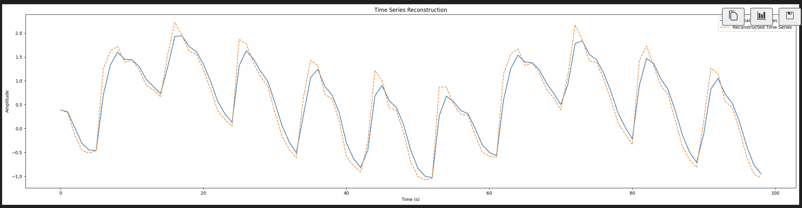

# Initial Thoughts

## Latency Estimates

First we must estimate some important values to inform our design process. We know the following information:

1) The needle moves at a max speed of 250mm/s and 250mm/s^2
2) The brain moves at a MAXIMUM speed of ~15mm/s as estimated from the data
3) Latency on estimating the distance to the brain is 15ms with a 5ms cooldown
4) The average size of a neuron is 20 microns (according to Google)
5) Assume we know the brain's position entirely accurately, and the robot has nanometer precision. Assume we also have perfect knowledge of the brians movement dynamics. Then, in terms of timing, to get ~20 micron accuracy and assuming the brain is moving at its MAXIMUM velocity of 15mm/s, we need ~1ms precision in our threading infrastructure.
6) Assume we have nanosecond precision on our commands, and nanometer precision on our distance estimates. Then, we must have 20 micron accuracy on the position of the brain within 15ms. The brain moves about 15mm/s, in 15 ms, would move about 200 microns. Thus, we need to guarantee 90% accuracy from a MAE perspective, 15ms out.
7) Latency to getting the robot position is minimal (10s of microseonds)

5 and 6 are our two main goals, although we will focus on the time goal primarily. Goal 6 is more of a modelling challenge, but for now, I will use a modified Kalman filter with a Fourier Estimate as my model. The Kalman filter will predict the location of the needle, and the control matrix in the Kalman filter will try to get the state to the commanded depth.

## Overall Design

We will have three main concurrent components: A robot state poller, a brain distance poller, and a movement controller. The state poller and brain distance poller will only poll the robot for their respective values and store them in a atomic queue. For now, we will keep all these concurrent components on the same thread, however, each can be moved to their own thread as the codebase matures. However, there are a couple of components in the code that may not be thread safe, namely where the command moves are placed, and this may need to be redesigned in the future. This design will guarantee enetual consistency in the robots state outside the brain.

The robot state poller is veyr simple: It periodically polls the robot for its state, and stores either the robot state or error in the atomic deque. This queue also serves as the localization software: If the front `MIN_LOCALIZATION_STATES` elements of the deque are the same and not errors, the robot is considered stationary and localized. 

## Calibration

After some very minimal analysis, it seems like an ARIMA model actually learns the dynamics of the brian movement very well. Due to ease of implementation of an ARIMA (not dealing with Fourier Analysis is nice), and the aforementioned queue design, it should work exceedilngly will in a Kalman filter. Here are some of the ARIMA results:

To have an idea of exactly how we want to control the robot, we must have robust predictions for the brain's movement. To do this, we need a calibration period, where the robot takes a 10 second recording of the brain's movement and creates a function to predict where the brain should be relative to the robot's insert_z at any given point. Given the smoothness of the brains movement, we should be able to use an arima model to predict the location of the brain one the order of 100' of milliseconds out.

Additionally, during the calibration period, we will calculate the pre move location, which is the locaiton 200 microns above the brians highest point in movement.

# Polling System

We keep a queue of the most updated positions of the brain and the robot by having two green threads that poll and add to an atomic queue. All atomic operations on the queue are guaranteed to be O(1) and extremely fast through the entire codebase, so atomicity isnt a latency issue.

## State Machine

There are 4 states: Dead, Out of Brain Uncalibrated, Out of Brain Calibrated, and In Brain. Note that, outside of the brain, we have not latency concerns on movements, so we can move with eventual consistency. Thus keeping track of our state is unncessary since we can simply loop moveing the robot to the location until we receive an successful acknowledgement from the robot.

While in the brain, while using the Kalman filter for control, we have to ensure that the robot can safely exit the brain in the instance of abnormal activity. Thus, we allow transitions from in brain or the out of brain calibrated state to the panic state, which is an intermediary that ensure we get the robot out of the brain and to the origin. From panic, we always transition to the out of brain uncalibrated state, after which we perform our aforementioned calibration swquence, move the robot to the premove locaiton, and return back to out of brain calibrated.

### Threading considerations wrt moving

Consider the situation when we are about to move and the brain distance function panics. If we use a single threaded application, there  isn't a problem because the state we have is inherently atomic since one thread means there is no contention. However, consider the case where we have one brain distance polling thread and one movement control thread. Here, we have a contention problem: If we want to guarantee atomicity with respect to state when we move (i.e. that we are in the state we expect to be in when we move), we must lock the state and move, holding the lock across an await. This doesnt seem smart because it makes the latency on panicing very high, since to panic, we must acquire he lock around the state, which could be locked across an await. The other option is to not to guarantee that you are in the state you expect to be when you call command_move - ie, you could also be in a panic state. This would allow the move on the robot to be called in the panic state after a move to zero from the panic handler is called, which also seems unideal but better than the previous option. This is becuase the panic handler will loop in always moving the robot out of the brain, so we can guarantee evetual consistency on the robot getting out. 

# Kalman Filter thoughts

Since we do not want to do open-loop control on the robot in the brain, we should somehow incorporate a Kalman filter. This would allow us to perform close loop control, let our predictions be 5-10ms out instead of seconds, and generally just be more precise. The Kalman filter could also model the time delay on getting the brains location as noise. Instead of moving the robot in one shot into the brain, we could move it a few microns, receive and update state in the Kalman filter, and move again.