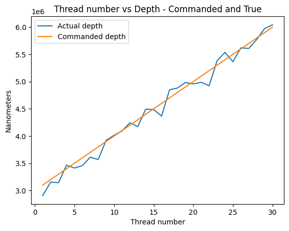

# Assumptions

## Note: My code is currently not production ready: it has errors and the code quality isnt great. This submission is more of a checkpoint while I finish up the final debugging and clean my code

- The brain moves at a maximum velocity of ~7mm/s (this is a stronger assumption than that in the data, but i havent yet tested how the code performs with more velocity).
- There are no position errors (I dont currently handle them).
- No network latency on moves from controller to robot
- Brain movement is locall quadratic
- The needle doesnt have to move for more than 300ms (necessary for good error bound in Taylor approximation)
- NeedleZ is redefined to be relative to InserterZ in code

# Design 

## Concurrent task goals

To ensure safety, we want to accomplish a few things. First, we want the robot to be able to handle significant frequency of errors in polling, as well as errors in moving the robot, and exist gracefully if it cant. Thus, our safety goals are as follows:

- Move while guaranteeing knowledge of robot state. Guarantee that the robot only moves according to a strict state machine, without race conditions. Specifically, guarantee that a robot can only be exiting the brain after a `panic` is called and before it is resolved.
- Brain movement prediction: Predict where the be to move needle with high precision. Since a neuron is ~20 microns big, we aim for 100 micron precision in our robot. Considering that robot moves can take up to 300 ms, we want to guarantee 100 micron precision 300 ms out.
- Abnormal brain movement/seizure detection: If local brain movements are further than what we expect, we assume the brain is "in a seizure" and exit immeditely (within ~20ms).

## Concurrency Methodology

The final design implements all robot control on one thread, mainly to avoid multithreading. Consider the concurrent tasks at hand: one must poll distances to the brain, poll the robot state, and have a concurrent task to move. The distance polling task is essentially IO bound, and thus coroutines will suffice. Having extremely low latency on robot state is also unnecessary since a success on `command_move` guarantees that a move was completed to where you want it to go. Thus, the only reason we would need significant parallel is if we wanted to threads to be able to call `command_move`. However, a naive implementation of two threads with the ability

| Thread A | Thread B |
|------------|-------------|
| `if {state.lock()} != panic:` | `*state.lock() = panic`|
| `     command_move(10).await` | `while move not successful: command_move(0).await` |

In between the first and second lines in thread A, thread B could set the state to panic, move to 0, and then quit, after which we would context switch back to thread A and unsafely move into the brain. This issue cannot be solved without holding the lock while the await completes. However, this would mean that, if the brain were to go into a seizure and panic, we wouldn't be able to set the state until it acquired the lock, which can take on the order of 200ms. This makes it practicaly infeasible to have two thread, each of which are allowed to move the robot. Since distance polling is IO bound, and robot state polling can happen on the order of milliseconds as well, we choose to use a single-threaded cooperative-concurrency based design. We create a state machine to guarantee that every task runs O(1) work before yielding to another task in the same thread.

## State Machine

To guarantee that our control system handles all errors correctly, we create a state machine. The 4 states are as follows: Panic, Out of Brain Uncalibrated, Out of Brain Calibrated, and In Brain. The transitions are as follows:

- Panic --> Out of Brain Uncalibrated
- Out of Brain Uncalibrated --> Out of Brain Calibrated
- Out of Brain Calibrated -- > In Brain, Panic
- In Brain --> Out of Brain Calibrated, Panic

Upon exiting each state, we additionally guarantee information about the locaiton of the robot state

- Panic: {0,0}
- Out of Brain Unalibrated: {`premove_location`, 0}
- Out of Brain Calibrated: {`premove_location`, 0}
- In Brain: No guarantees

In each of the transition stages, we guarantee the following:

- Panic --> OOBU: State ends up at {0,0}
- OOBU --> OOBC: New premove location is calculated (accounting for stark changes in brain activity)
- OOBC --> IB: Recent distance estimates are all valid (recent enough and received with good latency)
- IB --> Panic: No guarantees, only occurs if abnormal brain acitvity is noticed or if weve spent to long in the brain
- IB --> OOBC: On completion of affirmed error on move
- OOBC --> Panic: Abnormal brain activity

Note that making the distinction between out of brain and in brain is important because all moves out of the brain are not latency sensitive, and thus we can move outside of the brain simply by continuously `command_moving` to the location we want until we here a positive acknowledgement from the robot (eventual consistency). However, we cannot simply follow eventual consistency while moving into the brain. In fact, according to the spec, the thread is only attached to the needle with friction, and will be left in the brain at the location of insertion after the needle retracts. Firstly, this makes using a Kalman filter, as mentioned in the original design doc, essentially impossible. Next, using this assumption, after any `command_move` is called while InBrain, we assume that the thread has detached from the needle and consider the received result from the `command_move` as ground truth for whether the move was successful or not. Thus, we only ever call `command_move` once while InBrain.

Additionally, while panicing, we first retract the needle and then move to the origin, regardless of whether we are in or out of the brain. Even though triggering the panic state requires latency, moving should always be a safe operation, and thus we can once again use eventual consistency here. Finally, note that in the roginal design doc, I proposed using the values received by polling the robot state to check if we are stationary - stationary checking is entirely unnecessary in this formulation.

## Triggering the panic state quickly

Our brain distance polling tasks constantly polls the brain distance, predicts what distance it believes the brain should be, and panics if the received value is sufficiently different. This allows us to move the robot out of the brain in the case of a seizure with the same latency that polling happens.

We know that there is a ~15ms delay on await `get_brain_distance`, but we can poll eveyr 5ms. A naive implementation would have 15ms of latency on polling, but we can get this down to 5 by spawning tasks that await for us every 5ms. We construct the `polling_surface_distance` task that, every 5ms, spawns a new tokio task that awaits on `get_brain_distance()` and adds the result to a queue. Currently, each task sends the result over a channel to be added by another tasl, `process_distances`, but they could add the values to the queue themselves. Currently, we do not guarantee these values are added in order, but this can be easily done in the future by giving each task an id and having a variable (a mutex isnt necessary since its multithreaded) that tracks which task is supposed to add next. Tasks after the next task block until its their turn. I probably should implement this, since the distance queue is used for taylor approximations (explained later) which would be sensitive to this, but currently, the 5ms delay between spawning each tasks seems to suffice (I really should guarantee inorderedness though).

## Brain position esimtaion

I significantly changed my approach to brain position estimation from the initial design doc. The original design doc also didnt at all account for the fact that the robots movements are instantaneous. In the initial design doc, I mentioned I would use a fourier approximation of the brain, however, the fourier approximation seemed to do poorly on long horizons. I then tried training an arima model during the calibration phase after observing the brain. The Arima model, however, learned a simple derivative approximation to the predict the next time point: `f(t+1) = 2f(t) - f(t-1)`, which is essentially a first order Taylor approximation. Builiding off of this, I tried using a 4th order Taylor series approximation. This, however, didnt work, since small variations in the 3rd and 4th order coefficients would cause huge variations in prediction 300ms out (which is the time horizon we need). 2nd order Taylor approximations seemed to work best.

Additionally, since we only get one chance to move the needle per insertion, we must have precise, one-shot prediction for where to move the needle (as opposed to a closed-loop Kalman filter). Additionally, we must guarantee that the robot has 0 velcotiy at the end of its path, and that the end of the path must be approximately the commanded depth. Since the needle never reaches its maximum veloctiy in 300ms given its maximum acceleration, we can model the needles path from the origin as $d = \frac{1}{4} \cdot at^2$. Let $B(t)$ be the Taylor approximation of the brain from the brain surface distances we poll. Then, the estimated position relative to the inserter that we should move our needle is $$B(t_I) \text{ where } B(t_I) - \frac{1}{4}at_I^2 = 0 $$ 

To have as precise an estimate as possible, we only move the robot when the brain is closest to the robot. Assuming brain motion dynamics are relatively constant (we can assume this because we panic on abnormlities), we know the dynamics of the brain are consistent when they it is closest to the robot, and thus we can get lower-variance estimates on the coefficients of our Taylor polynomial by averaging (although this hasnt been implemented yet).

# Testing

Our testing methodology follows simply by simulating the actual robot. We ignore receving errors on polling the robot state for now, since its not really integral to our design (our design is almost blind to the robot state due to the state machine guarantees). While testing with errors, we set a 10% chance for any error to be thrown. 

## Multithreading

Since the robot simulation sleeps for the time the brain is moving, we cannot run it on the same thread as our latency sensitive control code (I accidentally did this). Instead, we create a new thread for the robot simulation and set up 3 concurrent tasks on this simulation thread, one for `command_move`, `get_robot_state` and `get_brain_distance` respectively. To communicate between the controller and the robot sim, we use one channel for each type of query. Since we need bidirectional communication, but in a query-response style, the controller sends a oneshot channel for the simulation on. 

## State estimation

To get an accurate estimate of where the robot placed the thread, we mock brain movement as a sum of 2 sin functions, `f(x)`. Calling `f` on the number of milliseconds since the thread spawned gives us an extremely precise brain position simulation. Alongside mocking moves with sleeping for the amount of time required by the robot's dynamics, we can simulate exactly where the brain is when the needle stops moving.

# Results

I havent gotten the graphs yet, but without errors/with only OCTErrors, we can achieve a mean of ~80 micron precision on all moves, although the precision can be as bad as 250 microns. One big issue with the current approach is that there is high variance. When we include move errors, the latency of the system increases, making our predictions worse. I am not entirely sure why this is and am still debugging it. Here is an example plot of the performance without errors:

Here is another example with OCTErrors:

And finallt, here is an example with Move errors:

Clearly, these errors are not currently safely handled. I suspect there is a bug in the state machine, but havent quite found it yet. The other two situations seem to perform well.

I also show that the surgery takes less than 10 seconds per thread for 30 threads, which is pretty fast (I think).